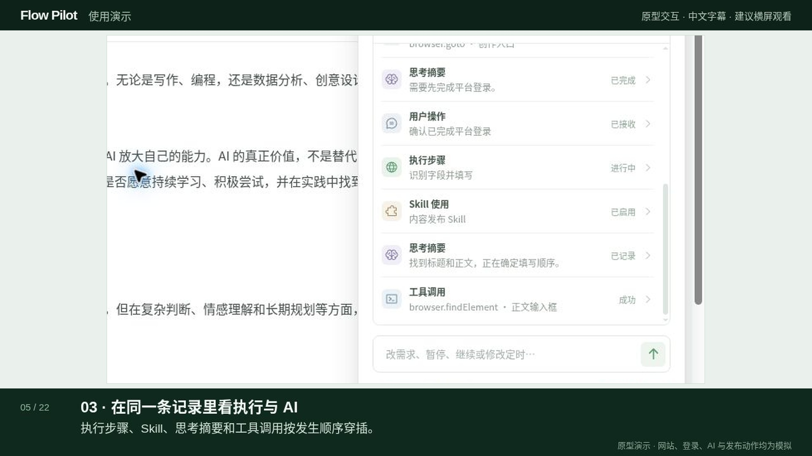

# Flow Pilot 交互原型

基于选定方案 3 的桌面软件界面原型。首页可输入目标并查看任务；任务页保留网页主体，并通过可移动、可收起的浮窗展示流程和 AI 分析。现在提供 Apple 芯片 Mac 的本地可执行版本，安装方式见 [DESKTOP.md](DESKTOP.md)。

## 使用演示

[观看 1 分 39 秒的使用视频](docs/demo/Flow-Pilot-demo.mp4)，包含任务创建、登录确认、AI / 工具 / Skill 记录、需求修改、暂停与终止，以及定时任务的设置和调整。视频带中文字幕，无配音。



## 运行

需要 Node.js 22 或更新版本。在仓库目录运行：

```bash
npm ci
npm run desktop:dev
```

桌面窗口会直接打开，无需另开浏览器。首页输入“我想在知乎发布文章”可演示查找平台、打开入口、检查登录、识别字段、填写与核对结果。输入“我想在知乎登录后发布文章”可演示等待用户登录确认的分支。任务详情中的“模拟下一步”用于推进演示。

浮窗中的执行步骤、思考摘要、工具调用和 Skill 使用按时间穿插展示，每条可展开详情。执行途中可以发送“改成在公众号发布文章”，任务会从新平台重新规划，并保留先前的活动记录；“标题改成：…”可改写示例文章。可暂停、终止、重新运行，返回任务列表后继续查看当前步骤。选择预置任务“检查文章格式”可查看只有执行事件的记录。

## 定时任务

首页可以输入“每天早上9点整理行业动态”，也可以点击输入框中的时钟设置时间。支持仅一次、每天、工作日（周一到周五）和每周。任务列表的“定时”筛选、时间标签，以及浮窗当前目标下方的时间行都可以管理定时规则。完成后的任务仍可添加重复规则。

在浮窗中可以直接发送：

- “改到晚上八点”：保留重复规则，修改后续运行时间。
- “明天这次取消，之后照常”：跳过指定的一天。
- “停止定时 / 恢复定时”：控制后续触发，保留当前运行。
- “暂停 / 继续执行”：保留本次进度并继续。
- “终止本次”：只结束当前这一轮。
- “全部停止”：结束当前执行并停用后续定时。

“试运行一次”立即启动演示，每约5秒推进一步；需要登录时等待用户确认。上一轮记录折叠在活动列表中，当前轮按事件发生顺序展开；最近12轮历史、当前进度和时间规则保存在本机。

定时使用本机时区，只在应用窗口打开、电脑唤醒时检查。关闭或休眠造成的较长延迟会跳过，不集中补跑；上一轮仍在执行或暂停时也会跳过新触发。自然语言调整是原型支持的规则解析，未接入语言模型。

本项目是前端交互原型，访问的网站、登录确认、AI 分析摘要、工具与 Skill 记录及发布动作均为模拟，不会连接外部平台或真正发布内容。浏览器界面仅用于预览桌面软件设计。

`public/qa/compare.html` 是桌面设计核对页面。

开发用网页预览可通过 `npm run dev` 打开。`npm run desktop:mac` 构建 Apple 芯片 Mac 应用；`npm run desktop:linux` 构建 Linux x64 应用。桌面资源通过应用内协议读取，不启动本地开发服务器。

## 验证

```bash
npm run build
node --test tests/*.test.mjs
```

测试覆盖定时规则、暂停与恢复、结束当前运行与停止后续定时、错过运行和避免重叠、桌面资源读取，以及网页预览的路由回退。
